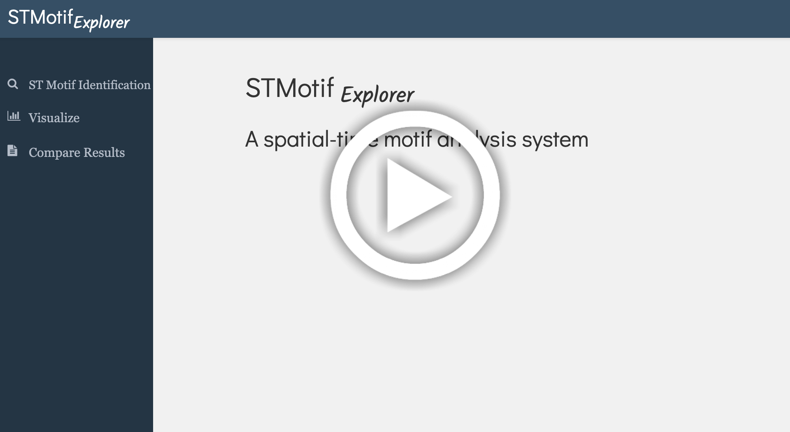

# STMotif-Explorer

STMotif Explorer is a spatial-time motif analysis system that aims to interactively discover and visualize spatial-time motifs in different domains, offering insight to users. This app enables users to use and implement novel spatiotemporal motif detection techniques and then run this across various domains. Besides, offers the users a set of interactive resources where it is possible to visualize and analyze the discovered motifs and compare the results from different techniques.

## Table of Contents

  - [Motivation and Purpose](#motivation-and-purpose)
  - [STMotif-Explorer: API](#stmotif-explorer-api)
  - [App Design](#app-design)
  - [Run the app locally](#run-the-app-locally)
  - [App Contributors](#app-contributors)
  - [License](#license)

## Motivation and Purpose

Pattern discovery is an important task in time series mining. A particular pattern that occurs a significant number of times in a time series is called a motif. Several approaches have been developed to discover motifs in time series. However, we can observe a clear gap regarding the exploration of the spatial-time series data according to the literature review. Also, it is challenging to understand and characterize the real meaning of the motif obtained concerning the data domain, comparing different approaches and analyzing the quality of the results obtained.

We propose STMotif Explorer, a spatial-time motif analysis system that aims to interactively discover, analyze, and visualize spatial-time motifs in different domains, offering insight to users. STMotif Explorer enables users to use and implement different spatiotemporal motif detection techniques and then run this across various domains. Besides, STMotif Explorer offers the users a set of interactive resources where it is possible to visualize and analyze the discovered motifs and compare the results from different techniques. We demonstrate the features of our system with different approaches using real data.

## STMotif-Explorer: API

The API enables users to interact with the infrastructure through three components. 

- **Register Algorithm and Rank Functions**   
The system architecture is modular, enabling the addition of new algorithms for execution through the interface. The user can register new functions for motif discovery and ranking. The canonical data structure STMotifDS was defined to ease the parameterization of the functions and subsequent comparison of the obtained results. This structure is made up of Motifs information, with the positions of its occurrences MotifPositions, and other information regarding each motif MotifInformation. This information is related to the result of the processing by the algorithm (such as the distance among the occurrences and entropy). Besides these, it is composed of the GenericInformation field, where information used by the algorithm is stored (such as the parameters and dataset reference). 

- **Register Datasets**  
An important task for verifying and validating an approach is execution across multiple domains. Users can also register new spatiotemporal datasets that can be used in the execution of registered algorithms through the interface. Besides, it is possible to register files containing the results of other algorithms and with the ground truth results, which can be used through the interface. These files are in RData format and follow the canonical data structure STMotifDS. All files need to be registered, with their signature of the functions, in the file CONFIG.xml to become available by the tool.

## App Design

## Run the app locally

1. Download [the repository]([https://github.com/cefet-rj-dal/stmotifexplorer](https://github.com/cefet-rj-dal/stmotifexplorer))
2. Install R: Download and install R from the official website (https://www.r-project.org/) based on your operating system. Follow the installation instructions provided.
3. Install an IDE or text editor: Choose and install an IDE or text editor for R programming. Popular options include RStudio (https://www.rstudio.com/) or Visual Studio Code (https://code.visualstudio.com/) with R extensions.
4. Open the IDE and the file "main.R" 
5. Execute the program: Use the provided button or command in the IDE or text editor to run the R program. Refer to the specific documentation of your chosen development environment for instructions on executing the code.
6. Analyze the results: After program execution, you can view the results within the IDE or text editor interface. If your R program generates any output, such as plots or tables, they will be displayed visually.

Finally, open the app at this URL: <http://localhost:8000/>

## App Contributors

- Heraldo Borges 
- Antonio Castro
- Rafaelli Coutinho
- Fabio Porto
- Esther Pacitti
- Eduardo Ogasawara

## License

`STMOTIF-explorer`  It is licensed under the terms of the [MIT License].
